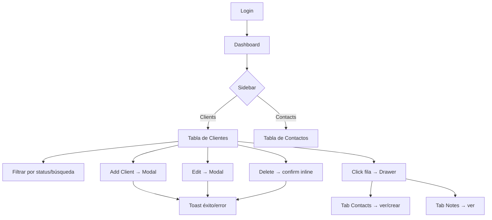

# Sidebar + CRUD para CRM Dashboard

Agregar una sidebar de navegación y operaciones CRUD completas (Clientes, Contactos y Notas) al `app.blade.php` existente. Todo se maneja en un solo archivo sin cambios en el backend — el frontend consume los endpoints que ya existen.

## Propuesta de UI

La app ya tiene un estilo **dark/gold** sólido (`--accent: #C8A951`, Outfit + Space Mono). La expansión respeta ese lenguaje visual:

- **Sidebar colapsable** a la izquierda (ancho fijo `220px`, colapsado `60px`)
- **Área de contenido** con secciones intercambiables: Dashboard · Clients · Contacts
- **Modales** para crear y editar registros
- **Toast notifications** para feedback (éxito/error)
- **Panel de detalle lateral** (drawer) al hacer click en un cliente: muestra sus contactos y notas inline

---

## Proposed Changes

### Layout principal

El `<body>` pasa de un layout de dos zonas (auth + dashboard) a un layout de **tres zonas**:

```
[Sidebar] | [Top header] 
           | [Content area — Dashboard / Clients / Contacts]
```

El header actual se ajusta: queda como banda superior sobre el área de contenido (no sobre la sidebar).

---

### [MODIFY] [app.blade.php](file:///home/enzo/Enzo/Proyectos/crm-api/resources/views/app.blade.php)

Es el único archivo que se modifica. Todos los cambios van aquí.

#### 1. CSS — nuevos tokens y componentes

Agregar estos bloques de estilos al `<style>` existente:

| Bloque | Qué agrega |
|---|---|
| `/* Sidebar */` | `.sidebar`, `.nav-item`, `.nav-icon`, `.nav-label`, `.sidebar-toggle` |
| `/* App Shell */` | `.app-shell` (flex row), `.main-area` (flex column = header + content) |
| `/* Table */` | `.data-table`, `thead`, `tbody tr`, `.row-actions`, `.btn-icon` |
| `/* Modal */` | `.modal-backdrop`, `.modal`, `.modal-header`, `.modal-body`, `.modal-footer` |
| `/* Drawer */` | `.drawer`, `.drawer-open`, `.drawer-overlay` — panel lateral de detalle |
| `/* Toast */` | `.toast-stack`, `.toast`, `.toast-success`, `.toast-error` |
| `/* Pagination */` | `.pagination`, `.page-btn` |
| `/* Badges de status */` | `.status-badge` + variantes (lead/active/inactive/churned) |

#### 2. HTML — estructura nueva

```
<body>
  <!-- Auth screen (sin cambios) -->
  <div x-show="!token" ...> ... </div>

  <!-- Dashboard shell (reemplaza el div x-show="token") -->
  <div x-show="token" class="app-shell" ...>

    <!-- SIDEBAR -->
    <aside class="sidebar" :class="{ collapsed: sidebarCollapsed }">
      <button class="sidebar-toggle" @click="sidebarCollapsed = !sidebarCollapsed">…</button>
      <nav>
        <button nav-item "dashboard">  Dashboard  </button>
        <button nav-item "clients">    Clients    </button>
        <button nav-item "contacts">   Contacts   </button>
      </nav>
      <!-- User pill al fondo -->
    </aside>

    <!-- MAIN AREA -->
    <div class="main-area">

      <!-- Header (sin botón de logout movido al sidebar user pill) -->
      <header class="dash-header"> … </header>

      <!-- Content Sections -->
      <div class="dash-body">

        <!-- Dashboard (el actual, sin cambios de lógica) -->
        <section x-show="section === 'dashboard'"> … </section>

        <!-- Clients CRUD -->
        <section x-show="section === 'clients'">
          [Filtro status + búsqueda]  [Btn Add Client]
          <table class="data-table"> … </table>
          <div class="pagination"> … </div>
        </section>

        <!-- Contacts list (read-only + create por cliente) -->
        <section x-show="section === 'contacts'">
          <table class="data-table"> … </table>
        </section>

      </div>
    </div>

    <!-- Drawer de detalle del cliente -->
    <div class="drawer" :class="{ 'drawer-open': drawerClient }">
      Tabs: Info · Contacts · Notes
    </div>

    <!-- Modal crear/editar cliente -->
    <div class="modal-backdrop" x-show="modal.open"> … </div>

    <!-- Toast stack -->
    <div class="toast-stack"> … </div>

  </div>
</body>
```

#### 3. Alpine.js — nuevo estado y métodos

Se reemplaza el objeto `crm()` por una versión expandida:

**Nuevo estado:**

| Variable | Tipo | Descripción |
|---|---|---|
| `section` | `string` | Sección activa: `'dashboard'` \| `'clients'` \| `'contacts'` |
| `sidebarCollapsed` | `bool` | Sidebar colapsada |
| `clients` | `array` | Lista paginada actual |
| `clientsMeta` | `object` | `{ current_page, last_page, total }` de la respuesta |
| `clientsPage` | `number` | Página actual |
| `clientsFilter` | `object` | `{ status: '', search: '' }` |
| `contacts` | `array` | Lista de contactos (global o por cliente) |
| `modal` | `object` | `{ open, mode: 'create'\|'edit', entity: 'client'\|'contact', data: {} }` |
| `drawerClient` | `object\|null` | Cliente seleccionado para el drawer |
| `drawerTab` | `string` | `'info'` \| `'contacts'` \| `'notes'` |
| `drawerContacts` | `array` | Contactos del cliente en el drawer |
| `drawerNotes` | `array` | Notas del cliente en el drawer |
| `toasts` | `array` | Lista de notificaciones activas |

**Nuevos métodos:**

| Método | Descripción |
|---|---|
| `navigate(sec)` | Cambia `section`, llama al loader correspondiente |
| `loadClients()` | `GET /api/clients?page=&status=&search=` → `clients`, `clientsMeta` |
| `saveClient()` | POST o PUT según `modal.mode` → cierra modal, recarga lista, toast |
| `deleteClient(id)` | DELETE con confirmación inline → recarga lista, toast |
| `restoreClient(id)` | POST `/api/clients/{id}/restore` → recarga lista, toast |
| `loadContacts()` | `GET /api/contacts` (global, paginado) |
| `openDrawer(client)` | Abre drawer, llama `loadDrawerData(client.id)` |
| `loadDrawerData(id)` | Paralelo: `GET /api/clients/{id}/contacts` + `GET /api/clients/{id}/notes` |
| `saveContact(clientId)` | POST `/api/clients/{clientId}/contacts` desde modal |
| `deleteContact(id)` | DELETE `/api/contacts/{id}` |
| `openModal(mode, entity, data)` | Configura y abre el modal genérico |
| `closeModal()` | Cierra modal, limpia `modal.data` |
| `toast(msg, type)` | Agrega toast, lo remueve después de 3s |

---

## Flujos de usuario



---

## Endpoints consumidos

| Operación | Método | URL |
|---|---|---|
| Listar clientes | GET | `/api/clients?page=N&status=X` |
| Crear cliente | POST | `/api/clients` |
| Actualizar cliente | PUT | `/api/clients/{id}` |
| Eliminar cliente | DELETE | `/api/clients/{id}` |
| Restaurar cliente | POST | `/api/clients/{id}/restore` |
| Listar contactos globales | GET | `/api/contacts` |
| Contactos por cliente | GET | `/api/clients/{id}/contacts` |
| Crear contacto | POST | `/api/clients/{id}/contacts` |
| Actualizar contacto | PUT | `/api/contacts/{id}` |
| Eliminar contacto | DELETE | `/api/contacts/{id}` |
| Notas por cliente | GET | `/api/clients/{id}/notes` |

> [!NOTE]
> El endpoint `GET /api/clients` acepta filtros como query params. Si el backend no soporta `?search=` todavía, el filtro de búsqueda se hará client-side sobre los resultados ya paginados.

---

## Open Questions

> [!IMPORTANT]
> **¿Querés incluir CRUD de Notas también?**
> El plan actual lee notas en el drawer pero no permite crearlas/editarlas desde la UI. Agregar el CRUD de notas sería fácil (mismo patrón), pero suma complejidad. ¿Lo incluimos?

> [!IMPORTANT]  
> **¿La sección "Contacts" global es necesaria?**
> El plan incluye una sección de Contacts que lista todos los contactos de todos los clientes. Alternativamente, los contactos solo se gestionan desde dentro del drawer de un cliente. ¿Cuál preferís?

---

## Verification Plan

### Automated checks
- `php artisan route:list` para confirmar que todos los endpoints existen
- `php artisan serve` y navegar manualmente

### Manual verification
1. Login funciona y lleva al dashboard con sidebar
2. Navegar a Clients → tabla carga con paginación
3. Crear cliente → aparece en la tabla + toast verde
4. Editar cliente → modal pre-poblado → guarda cambios + toast
5. Eliminar cliente → desaparece de lista + toast
6. Click en fila → drawer abre, tab Contacts muestra contactos del cliente
7. Crear contacto desde drawer → aparece en la lista
8. Sidebar colapsa/expande correctamente
9. Responsive en mobile (sidebar en overlay o hidden)
